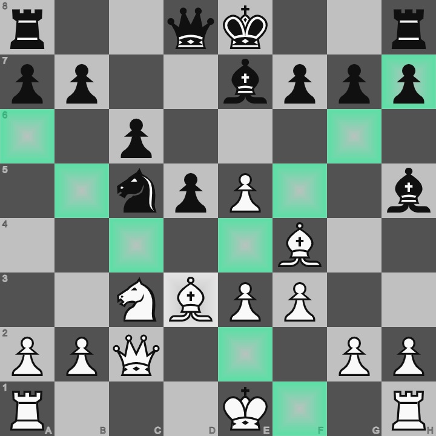

# Web Chess

Made using basic javascript

### Implementation check-list

- [ ] Check logic (checks, mates, pins, W/L)
- [x] Castling
- [ ] Pawn promotion
- [x] En passant

### Used resources

[Alpha piece set](https://github.com/ornicar/lila/tree/master/public/piece/alpha) [(credit to Eric Bentzen)](https://github.com/ornicar/lila/blob/master/COPYING.md#exceptions-non-free)

[Move sound effect](https://freesound.org/people/mh2o/sounds/351518)

[Open Sans font](https://www.fontsquirrel.com/fonts/open-sans) [(generated to WOFF2 with only ASCII chars)](https://www.fontsquirrel.com/tools/webfont-generator)

[Example image game (Magnus Carlsen vs. Andrew Tang bullet)](https://lichess.org/0JWc9Xbd)

---

